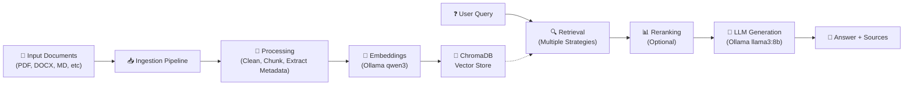
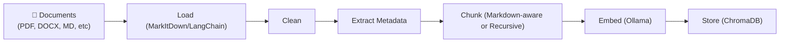
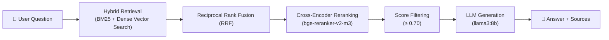

# RAG Pipeline 

A Retrieval-Augmented Generation (RAG) chatbot that ingests documents, generates embeddings, stores them in a vector database, and answers questions using a locally-running LLM. No API keys required — all models run locally via Ollama.

# Architecture

## Features

- **Streamlit Web UI** — Interactive chat interface with document upload, sidebar settings, and source citations
- **Hybrid Retrieval** — Combines BM25 (keyword) + Dense (semantic) search with Reciprocal Rank Fusion
- **Cross-Encoder Reranking** — Second-pass reranking with score threshold filtering
- **Multi-Format Ingestion** — Supports PDF, DOCX, PPTX, XLSX, HTML, TXT, MD, CSV, JSON
- **Markdown-Aware Chunking** — Preserves document heading structure for better context
- **100% Local** — No API keys needed; all models run locally via Ollama

## Project Structure

```
QA-Chatbot/
├── config.py                  # Central configuration (PipelineConfig dataclass)
├── requirements.txt           # Python dependencies
├── app.py                     # Streamlit web UI
├── README.md
│
├── ingestion/                 # Document ingestion pipeline
│   ├── loader.py              # Multi-format file loading (MarkItDown + LangChain)
│   ├── splitter.py            # Chunking strategies (Recursive, Markdown, Auto)
│   ├── embeddings.py          # Ollama embedding management
│   ├── vector_store.py        # ChromaDB wrapper
│   ├── pipeline.py            # Orchestrates full ingestion workflow
│   └── processors/
│       ├── cleaner.py         # Text normalization
│       └── metadata_extract.py # Content hashing, keyword extraction, metadata
│
├── retrieval/                 # Document retrieval pipeline
│   ├── retriever.py           # BM25, Dense, and Hybrid retrievers
│   ├── reranker.py            # Cross-encoder reranking (bge-reranker-v2-m3)
│   └── retrieval_pipeline.py  # Orchestrates retrieval + reranking
│
├── generation/                # LLM generation
│   ├── llm.py                 # Ollama ChatOllama wrapper
│   ├── query_processor.py     # Query preprocessing and expansion
│   └── chat_interface.py      # Interactive CLI chat session
│
├── rag/                       # RAG chain orchestration
│   ├── rag_chain.py           # Combines retrieval + generation
│   └── main.py                # CLI entry point with argparse
│
├── test/                      # Test scripts
│   ├── test_pipeline.py       # Full ingestion pipeline test
│   ├── test_chat.py           # RAG + chat mode test
│   ├── test_embeddings.py     # Embedding model connectivity test
│   ├── test_vectorstore.py    # ChromaDB operations test
│   ├── test_retrieval.py      # BM25, Dense, Hybrid, Reranker tests
│   └── test_performance.py    # Ingestion speed benchmark
│
├── data/                      # Input documents directory
└── docs/                      # Documentation
```

## Prerequisites

1. **Python 3.11+**
2. **[Ollama](https://ollama.com/)** installed and running

```bash
ollama serve
```

3. **Pull required models**

```bash
ollama pull llama3:8b
ollama pull qwen3-embedding:0.6b
```

## Installation

```bash
git clone <repo-url>
cd QA-Chatbot
python -m venv .venv
.venv\Scripts\activate        # Windows
pip install -r requirements.txt
```

## Usage

### Streamlit Web UI

```bash
streamlit run app.py
```

Opens a browser with:
- Sidebar settings (K, score threshold, temperature)
- Document upload with drag-and-drop
- Vector store management (clean/reinitialize)
- Chat interface with source citations

### CLI — Ingest and Chat

```bash
python -m rag.main --chat                       # Ingest ./data, then chat
python -m rag.main --file data/report.pdf --chat # Ingest single file
```

### CLI — Query Only

```bash
python -m rag.main --query-only --query "What is machine learning?"
```

### CLI — Ingest Only

```bash
python -m rag.main --dir ./data
```

### CLI Arguments

| Argument | Description |
|---|---|
| `--file` | Process a single file |
| `--dir` | Process a directory |
| `--k` | Top-K documents to retrieve (default: 5) |
| `--threshold` | Reranker score threshold (default: 0.70) |
| `--reranker-model` | Override reranker model |
| `--query` | Single query to answer |
| `--query-only` | Skip ingestion, only query |
| `--chat` | Start interactive chat mode |
| `--llm` | Override LLM model name |

### Interactive Chat (CLI)

```bash
python generation/chat_interface.py
```

Commands: `/help`, `/history`, `/clear`, `/quit`

### Standalone Tests

```bash
python test/test_pipeline.py
python test/test_chat.py
python test/test_embeddings.py
python test/test_vectorstore.py
python test/test_retrieval.py
python test/test_performance.py
```

## Configuration

All settings are in `config.py` via the `PipelineConfig` dataclass:

| Parameter | Default | Description |
|---|---|---|
| `chunk_size` | `640` | Max characters per chunk |
| `chunk_overlap` | `96` | Overlap between chunks |
| `chat_model` | `llama3:8b` | Ollama chat model |
| `temperature` | `0.8` | LLM sampling temperature |
| `base_url` | `http://localhost:11434` | Ollama server URL |
| `embedding_model` | `qwen3-embedding:0.6b` | Embedding model |
| `embedding_dimension` | `768` | Embedding vector dimension |
| `reranker_model` | `BAAI/bge-reranker-v2-m3` | Cross-encoder reranker |
| `threshold` | `0.70` | Min reranker score to keep a result |
| `chroma_persist_dir` | `./chroma_db` | ChromaDB storage path |
| `collection_name` | `my_rag_collection` | ChromaDB collection name |
| `input_dir` | `./data` | Default input directory |
| `log_level` | `INFO` | Logging level |

## How It Works

### Ingestion Pipeline


1. **Loading** — Supports 10 formats: PDF, DOCX, PPTX, XLSX, HTML, TXT, MD, CSV, JSON
2. **Cleaning** — Normalizes whitespace, removes BOM/non-breaking spaces
3. **Metadata** — MD5 content hash (dedup), title, keywords, word count, timestamps
4. **Chunking** — Auto-selects `MarkdownTextSplitter` or `RecursiveCharacterTextSplitter`
5. **Storage** — 768-dim embeddings via Ollama, persisted in ChromaDB

### Query Pipeline



1. **Dual Retrieval** — BM25 (keyword) + Dense (semantic) run in parallel
2. **RRF Fusion** — Merges ranked lists via Reciprocal Rank Fusion (k=60)
3. **Reranking** — Cross-encoder rescores candidates; below-threshold results filtered
4. **Generation** — Context-grounded answer via `llama3:8b`

## Supported File Formats

| Extension | Loader |
|---|---|
| `.pdf` | MarkItDown (Markdown conversion) |
| `.doc`, `.docx` | MarkItDown |
| `.ppt`, `.pptx` | MarkItDown |
| `.xlsx`, `.xls` | MarkItDown |
| `.html` | MarkItDown |
| `.txt` | LangChain TextLoader |
| `.md` | LangChain UnstructuredMarkdownLoader |
| `.csv` | LangChain CSVLoader |
| `.json` | LangChain JSONLoader |

## Design Highlights

- **100% Local** — No API keys; all models run locally via Ollama
- **Hybrid Retrieval** — Combines keyword (BM25) and semantic (dense vector) search for better recall
- **Cross-Encoder Reranking** — Second-pass reranking with score threshold filtering for precision
- **Markdown-Aware Chunking** — Preserves document heading structure for better context
- **Fallback Patterns** — Reranker gracefully falls back to keyword-overlap scoring if cross-encoder fails
- **Persistent Storage** — ChromaDB persists to disk, surviving restarts
- **Dual Interface** — Streamlit web UI + CLI for flexibility
